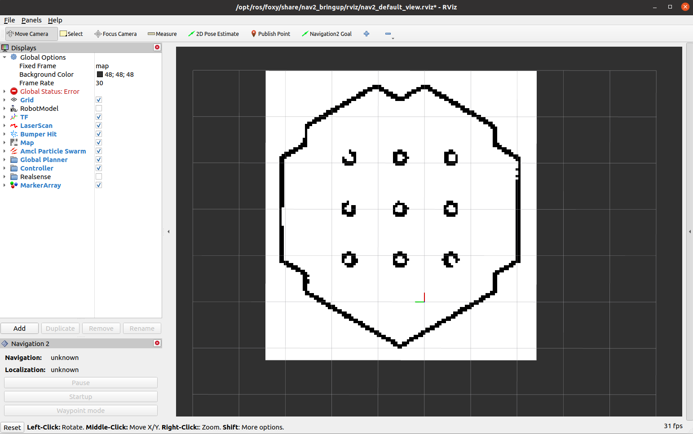
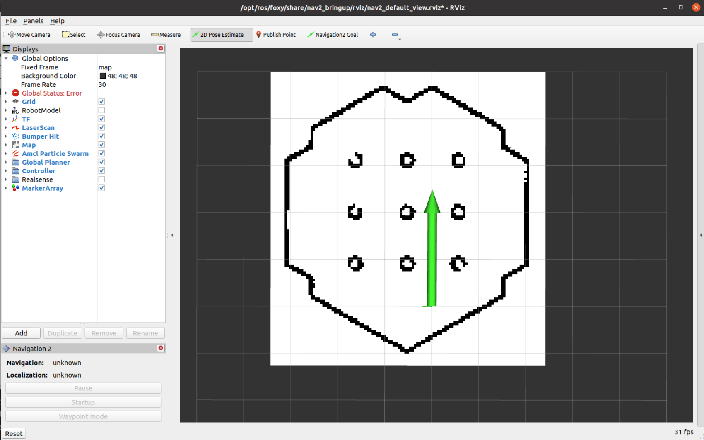
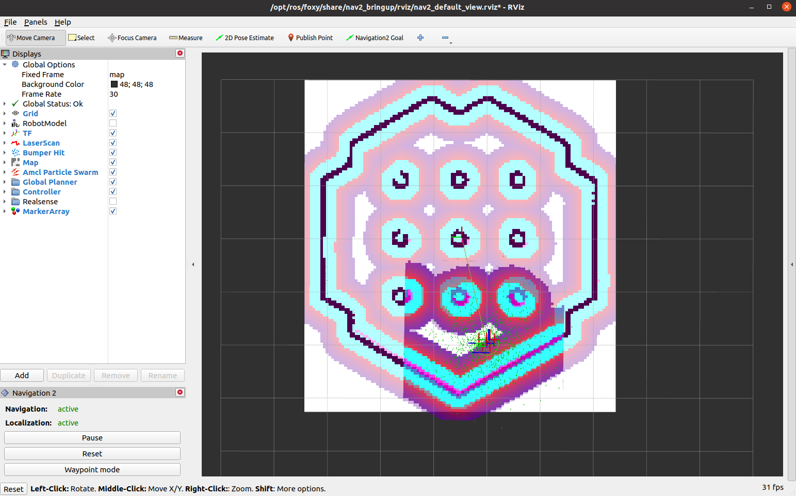
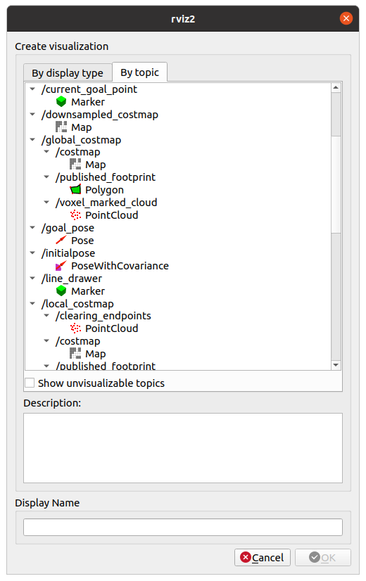
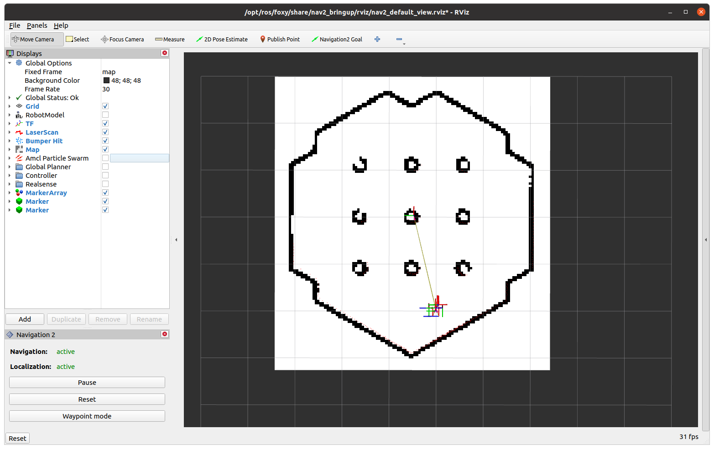
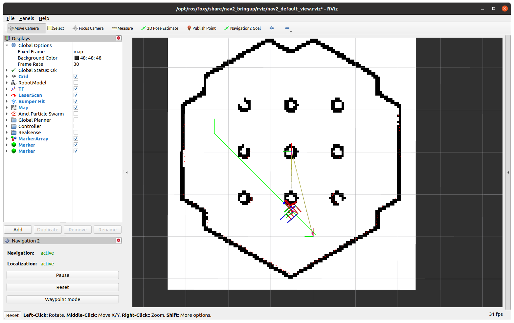

# Evaluating and Devising Path Planning Algorithms in Robots


Implementation of various path planning algorithms and experimentation of our novel A* algorithm, found in the weight_map branch.

Collaborators:
* z5488740 Seung Hwan Cha
* z5599593 Kyle Zhang
* z5480597 Frederick Lu
* z5580745 Jack Ma


Each branch features one implementation of path planning algorithm and experimentation discussed in Section 2 and 3.

* `main`: A*
* `dijkstra`: Dijkstra's
* `bfs`: Breadth First Search
* `weighted-astar`: Weighted A* 
* `APF`: Artificial Potential Field
* `weight_map`: Novel Modified A* and Weight Map
* `map_expander`: Inflated Map, running with A*.


In addition, you can watch how our novel A* algorithm behaves:
* https://youtu.be/IBsjNIw2sfk
* https://youtu.be/404K9VSpr4s

# Getting Started

ROS2 and turtlebot3 packages must be installed. If you don't have them, follow the official tutorial and install them.

clone the repository
```console
$ git clone https://github.com/seung-cha/3821_ws.git
```
It should create a directory named `3821_ws`. Inside the directory, call `colcon build`.

```console
$ cd 3821_ws
3821_ws$ colcon build
```
you must run `colcon build` in the root of the workspace.

Then, source the workspace using `install/setup.bash`.
```console
3821_ws$ source install/setup.bash
```

You need to do this for EVERY terminal you open. I recommend putting this in bashrc.

```console
3821_ws$ xdg-open ~/.bashrc

In the text editor, write (after the "source /opt/ros/..."):
source {abs_path_to_3821_ws}/install/setup.bash
```

Additionally, append the following three commands in bashrc.
```console
export TURTLEBOT3_MODEL=waffle

alias robotnav="ros2 launch turtlebot3_navigation2 navigation2.launch.py map:={abs_path_to_3821_ws}/src/3821_proj/map.yaml use_sim_time:=true"

alias robotsim="ros2 launch turtlebot3_gazebo turtlebot3_world.launch.py"

alias 3821="ros2 launch 3821_proj 3821_launcher.launch.py"
```

The first command is required by the simulation and the rest are alias to launch navigation, simulation and code without tedious lines of commands.

Then, open up a new terminal or on the same terminal, enter the following command:
```console
source ~/.bashrc
```

# Running the Code
Once you have installed turtlebot and sourced the workspace, you can start running simulation and code.

You will need 3 terminals to run simulation, code and navigation, sequentially.

In the first terminal, run the following command:
```console
$ robotsim
```

It will start the simulation in a GUI application `gazebo`.

In the second terminal, run the following command:
```console
$ 3821
```
it will start the planner and follower.

In the last terminal, run the following command:
```console
$ robotnav
```
It starts another GUI application `rviz`.

## Note
`path_planner.py` requires map data to work. The map data is published by `robotnav` ONLY once on the start. If you run `robotnav` first, `3821` will not receive the map data.

# Testing Path Planner
You will be sending destination for your path-planning algorithm in `rviz`. You can observe how the robot follows the path in `gazebo`.

If everything goes correctly, your `rviz` should look like this:



Observe the axis mark at the bottom of the map. That is the starting location of the robot. If you don't see it, relaunch everything again. 

Click on `2D Pose Estimate (Top)` and hold your mouse at the centre of the axis mark. Then, drag it towards the red axis so that the arrow points in that direction.



If you release it, `rviz` should look like this (relaunch everything if it doesn't look the same):



Then, click on `Add (Bottom Left)`. A new window will pop up. In there, click on `By Topic` and double click on `Marker` under `/line_drawer` and `/current_goal_point`.



`/line_drawer` visualises the generated path as a green line.

`/current_goal_point` visualises the point that the robot is following as a blue dot.

Untick `Amcl Particle Swarm`, `Global Planner`, `Controller` for visibility.


Finally, if you click on `Publish Point` and then click on somewhere on the map, you should see a path and robot following that path in `gazebo`.



# Code
* `path_planner.py`: Generates a path for a given goal. Implement and/or modify your path-planning algorithm in here.

* `path_follower.py`: Follows a path as strictly as possible. It has no safety features such as collision detection and avoidance.

* `Heap.py`: Implemented in Helper directory. It's a min heap that stores tuples of cost, x, y coordinates, sorted by increasing cost. You can customise the class for your need.

* `Plotter.py`: Implemented in Helper directory. It's a wrapper around Pyplot to display figures. You are more than welcome to expand it for your need (please do so).


## Helper Scripts
To use helper scripts, simply do the following in your code:
```py
from .Helper import Smth
```

For example, to use `Plotter.py`,
```py
from .Helper import Plotter
```


If you want to use a specific class `Class` defined in a script `Script`:
```py
from .Helper.Script import Class
```

For example, to use `MinHeap` defined in `Heap.py`:
```py
from .Helper.Heap import MinHeap
```

If you need to create your own helper classes or functions please do so in Helper directory.


# Classes and Consts in `path_planner.py`
There are lots of classes in `path_planner.py`. You will only need to use `Map`, `PointI` and `RosNode`.

# Map
`Map` represents a grid cell graph where each cell has an integer coordinate `(x,y)`.

One use of `Map` is Occupancy Grid. In `RosNode`, `self.map` represents the world represented in Occupancy Grid. Each cell in this graph has a value of `0` or `1`, representing whether the cell is occupied (`1`) or not (`0`).

The variables and functions defined in `Map` are as follows:

### _Variables_

* `width`: Integer variable that represents the width of the map.

* `height`: Integer variable that represents the height of the map.

* `resolution`: Float variable that represents the resolution of the map (You won't need to use this).

* `map`: 1D array of size `width * height` that represents each cell. Do not directly access it.

* `origin`: List of floats (3 elements) that represents the origin of the map. Note that the origin is not necessarily `<0.0, 0.0, 0.0>`.

### _Functions_

* `Cost_i(x, y)`: The value of the cell at coordinate `<x, y>`, where `x, y` are integers. You access the map using `Cell Coordinates`.

* `Cost_f(x, y)`: The value of the cell at coordinate `<x, y>`, where `x, y` are floats. You access the map using `World Coordinates`.

* `ToIndices(x, y)`: Returns `PointI` that represents the `World Coordinates` in `Cell Coordinates`.

* `ToCoordinates(x, y)`: Returns `Point` that represents the `Cell Coordinates` in `World Coordinates`.

* `SetCost(x, y, value)`: Sets the value of the cell at `<x, y> (Cell Coordinate)` with the argument. The type must be consistent.

* `Copy()`: Return a deep copy instance.

* `CopyBlank()`: Return a deep copy instance. Each cell has a value of 0.

* `CopySet(value)`: Return a deep copy instance. Each cell has `value`. You can create a predecessor map, cost map etc with this.

* `PlotMap()`: Call this method as the argument of `Plotter.ShowMap` to display the map in Pyplot figure.


### World and Cell Coordinates
Because Occupancy Grid is essentially a 2D array where each cell represents a small square segment of the world, You need to convert `World Coordinates` (each axis represented in real numbers) into `Cell Coordinates` (each axis represented in integer [0, +inf)). `ToIndices(x, y)` and `ToCoordinates(x, y)` will handle the conversion for you.

# PointI
It's basically a struct to represent `Cell Coordinates`.\
 Use `Point` instead to represent `World Coordinates`.

# RosNode
It handles the communication between the script to the robot. You will not need to change anything unless you need to.


You will be implementing your path-planning algorithm in `MakePath(s, e)`. Currently, the code looks like this:

```py
def MakePath(self, s:Point, e:Point):
        start = self.map.ToIndices(s.x, s.y)
        end = self.map.ToIndices(e.x, e.y)

        self.lineDrawer.Begin()

        ############################################
        # Implement a path planning algorithm here #
        #  Algorithm must return a list of PointI  #
        #        and It should be named path       #
        ############################################

        a_star = A_star(start, end, self.map)


        path:list[PointI]
        path = a_star.Run()

        ############################################
        #  Some path visualisation code down here  #
```
As it says, you will be implementing a path planning algorithm that returns a list of `PointI`. Source and destination of the path are represented in `Cell Coordinates` and named `start, end` respectively (`s, e` represents the source and destination in `World Coordinates`). Occupancy grid of the world is stored in `self.map`.

`start` is always the current location of the robot.

Currently, A* algorithm is implemented to generate a path. We will need to modify the algorithm to improve the efficiency of it.

Improvements can be in forms of:
* Safety of the path
* Smoothness of the path
* Length of the path
* Time taken to generate a path
* Time taken for the robot to follow the path
* Memory usage when making the path
* more


Some useful variables defined in `RosNode` are:
* `robotPosition`: Robot's current `<x, y, z>` coordinates expressed in `World Coordinates`.
* `Robot_Cell_Radius`: Radius of the robot expressed in terms of the numbers of cells. This value is 0 until map is acquired.

## Units and Distance Conversion
`gazebo` and `rviz` uses metre. Hence, you can assume that the code also uses metre.

Approximate radius of the robot is defined in `ROBOT_RADIUS`. This value is approximately half the width of the robot.

Distance values (such as `ROBOT_RADIUS`) cannot be pre-computed in terms of the number of cells since cell density determines the number of cells in one metre. If you need to compute distance in terms of cells, you can do the following:

```py
CELL_DISTANCE = self.map.ToIndices(x= WORLD_DISTANCE + self.map.origin[0], y= self.map.origin[1]).x
```
This will express the distance in terms of the number of cells.

As mentioned before, the origin of `self.map` is not necessarily `<0, 0, 0>`. So be careful when you are doing conversion.


